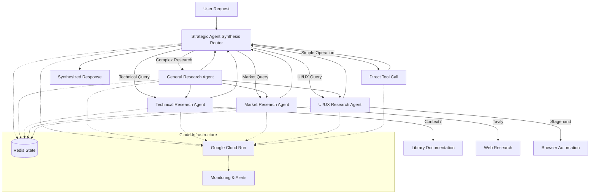

# Strategic Agent Synthesis Architecture Implementation

## Overview

This document outlines the implementation of the Strategic Agent Synthesis Architecture for Guidant, which optimizes complex operations with specialized AI agents while preserving direct tool calls for simple operations.

### Architecture Diagram



## Completed Work

### 1. Project Structure

We've established a complete project structure for the Strategic Agent Synthesis Architecture:

```
cloud/mastra/
├── src/
│   ├── agents/
│   │   ├── general-research.ts
│   │   ├── market-research.ts
│   │   ├── technical-research.ts
│   │   └── uiux-research.ts
│   ├── integration/
│   │   └── index.ts
│   ├── mcp/
│   │   └── server-config.ts
│   ├── synthesis/
│   │   ├── router.ts
│   │   └── router.test.ts
│   ├── utils/
│   │   ├── config.ts
│   │   └── env.ts
│   ├── index.ts
│   ├── server.ts
│   └── server.test.ts
├── Dockerfile
├── README.md
├── cloud-run-service.yaml
├── cloudbuild.yaml
├── monitoring.yaml
├── package.json
├── tsconfig.json
├── vitest.config.ts
└── workload-identity.yaml
```

### 2. Core Components

1. **Strategic Agent Synthesis Router** (`router.ts`)
   - Implements intelligent routing logic
   - Analyzes request complexity to determine routing
   - Routes operations to specialized agents or direct tool calls

2. **MCP Server Configuration** (`server-config.ts`)
   - Integration with Context7, Tavily, Firecrawl, and Stagehand
   - Tool category definitions for routing decisions

3. **Main Orchestration** (`index.ts`)
   - Central application with error handling
   - MCP client management
   - Agent initialization and coordination

4. **Specialized Agents**:
   - **Technical Research Agent** - For library documentation and architecture recommendations
   - **Market Research Agent** - For competitive intelligence and market trends
   - **UI/UX Research Agent** - Specializes in competitor UI analysis using Stagehand
   - **General Research Agent** - Orchestrates complex research tasks

5. **Express Server** (`server.ts`)
   - API endpoints for synthesis operations
   - Health check and monitoring endpoints
   - Error handling and middleware configuration

6. **Configuration Utility** (`config.ts` and `env.ts`)
   - Environment variable validation using Zod
   - Configuration loading and validation

### 3. Deployment Configuration

1. **Dockerfile**
   - Multi-stage build for optimized container size
   - Node.js 20 base image
   - Production-ready configuration

2. **Cloud Run Service Configuration**
   - Auto-scaling settings (min=1, max=10)
   - Resource allocation (2 CPU, 4GB memory)
   - Environment variable configuration

3. **Workload Identity**
   - Zero-trust security configuration
   - IAM permissions for storage, AI, and Redis access

4. **Monitoring and Alerting**
   - Error rate and latency alerts
   - Dashboard configuration for key metrics

### 4. Testing Framework

1. **Vitest Configuration**
   - Test environment setup
   - Coverage reporting configuration

2. **Unit Tests**
   - Router component tests
   - Server API endpoint tests
   - Mock implementations for dependencies

### 5. CI/CD Pipeline

1. **Cloud Build Configuration**
   - Automated build, test, and deployment steps
   - Container registry integration
   - Deployment to Cloud Run

### 6. Documentation

1. **README.md**
   - Project overview and architecture
   - Installation and usage instructions
   - API endpoint documentation

2. **Architecture Documentation**
   - Strategic Agent Synthesis approach
   - Component interaction diagrams
   - Deployment architecture

## Next Steps

### 1. Fix TypeScript Errors

The current implementation has TypeScript errors that need to be addressed:

- Fix import errors for `@mastra/loggers` and `@mastra/mcp`
- Properly implement agent class interfaces
- Add missing type definitions
- Resolve parameter type issues in function calls

### 2. Implement Agent Functionality

Each specialized agent needs complete implementation:

1. **Technical Research Agent**
   - Implement Context7 integration for library documentation
   - Add technical validation tools
   - Create architecture analysis capabilities

2. **Market Research Agent**
   - Implement Tavily integration for web research
   - Add competitor analysis tools
   - Create market trend analysis capabilities

3. **UI/UX Research Agent**
   - Implement Stagehand integration for browser automation
   - Add UI pattern analysis tools
   - Create design trend analysis capabilities

4. **General Research Agent**
   - Implement orchestration logic for multi-domain research
   - Add synthesis capabilities for combining results from specialized agents
   - Create comprehensive analysis tools

### 3. Set Up State Management

1. **Redis Integration**
   - Configure Redis client
   - Implement state persistence
   - Add caching mechanisms for performance optimization

### 4. Environment Configuration

1. **Environment Variables**
   - Create production environment variables
   - Set up secrets management for API keys
   - Configure Cloud Run environment

### 5. Testing and Validation

1. **Integration Tests**
   - Test agent interactions
   - Validate routing logic with real requests
   - Performance testing under load

2. **End-to-End Testing**
   - Test complete workflows
   - Validate integration with Guidant
   - Test deployment pipeline

### 6. Documentation Updates

1. **API Documentation**
   - Complete API reference
   - Usage examples
   - Integration guides

2. **Operational Documentation**
   - Deployment procedures
   - Monitoring guidelines
   - Troubleshooting steps

## Implementation Timeline and Priorities

### Phase 1: Core Functionality (1-2 weeks)
1. Fix TypeScript errors and implement proper interfaces
2. Complete Technical Research Agent implementation
3. Set up Redis state management
4. Configure environment variables
5. Create basic integration tests

### Phase 2: Enhanced Capabilities (2-3 weeks)
1. Complete Market Research Agent implementation
2. Complete UI/UX Research Agent implementation
3. Implement caching mechanisms
4. Add comprehensive error handling
5. Create advanced integration tests

### Phase 3: Orchestration and Deployment (1-2 weeks)
1. Complete General Research Agent implementation
2. Finalize CI/CD pipeline
3. Set up monitoring and alerting
4. Create operational documentation
5. Perform end-to-end testing

### Phase 4: Optimization and Scaling (Ongoing)
1. Performance optimization
2. Cost optimization
3. Enhanced caching strategies
4. Multi-region deployment
5. Custom model fine-tuning

## Conclusion

The Strategic Agent Synthesis Architecture implementation has established a solid foundation with all core components in place. The next steps focus on completing the implementation details, fixing TypeScript errors, and ensuring proper integration with the Mastra AI framework and external services.

This architecture will significantly enhance Guidant's research capabilities by providing specialized, intelligent agents for complex operations while maintaining efficient direct tool calls for simple operations. By following the implementation timeline and priorities, we can systematically complete the remaining work and deliver a robust, scalable solution. 